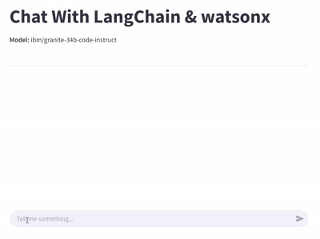

# Chat With LangChain & watsonx

## Overview

This project is a simple chatbot application that use [LangChain](https://www.langchain.com/) to interact with [IBM's watsonx AI platform](https://www.ibm.com/watsonx) to use the [Granite 3.1 foundation model](https://www.ibm.com/granite).

It demonstrates how to integrate an AI assistant into a simple web-based application.

## Technologies

- [**Python.**](https://www.python.org/)
- [**LangChain**](https://www.langchain.com/)
- [**IBM watsonx.**](https://www.ibm.com/watsonx)
- [**Streamlit.**](https://streamlit.io/)

## Features

- **IBM watsonx Integration:** Utilizes the [Granite 3.1 foundation model](https://www.ibm.com/granite) model hosted on [IBM's watsonx AI platform](https://www.ibm.com/watsonx) using [LangChain](https://www.langchain.com/).
- **Interactive Chat Interface:** Allows users to have conversations with the AI assistant through a web-based chat UI.
- **Prompt Engineering:** Constructs system and user prompts for contextual understanding.
- **Streaming Responses:** Displays responses in real time.
- **Session Persistence:** Maintains conversation history for a continuous experience during the conversation.

## Demo



## Prerequisites

To run this project, you need:

- [Python.](https://www.python.org/)
- [Anaconda.](https://anaconda.org/)
- [IBM Cloud Account API Key.](https://www.ibm.com/cloud)
- [watsonx Project.](https://www.ibm.com/watsonx)

## Installation

1. Clone the repository:

   ```sh
   git clone https://github.com/CHANGE_FOR_YOUR_GITHUB_USERNAME/demos.git

   cd ./demos/watsonx_langchain_chat
   ```

2. Create and activate a new Anaconda environment:

   ```sh
   conda env create -f environment.yml

   conda activate watsonx-langchain-chat-env
   ```

3. Set up environment variables:

   Create a `.env` file in the root directory of the project with the following environment variables.

   ```env
   WATSONX_PROJECT_ID=CHANGE_FOR_YOUR_WATSONX_PROJECT_ID
   API_KEY=CHANGE_FOR_YOUR_IBM_CLOUD_API_KEY
   ```

## Running The Application

Start the app:

```sh
streamlit run main.py
```

## Project Objective

This project was built to showcase the capabilities of the [mentioned technologies](#technologies) in developing AI-powered applications.
