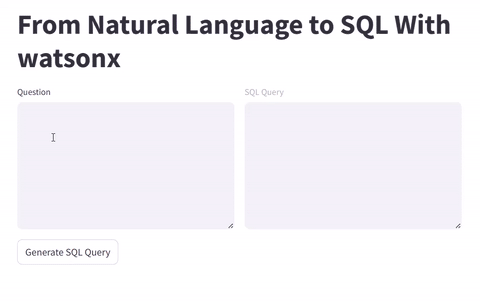
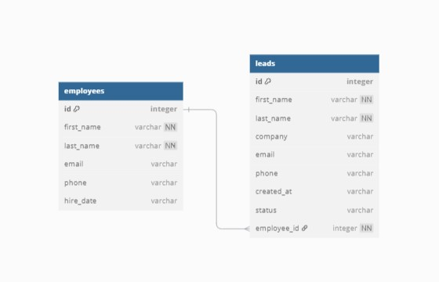

# From Natural Language To SQL With watsonx

## Overview

This project is a demo application that converts natural language questions into syntactically valid SQL queries using [IBM watsonx](https://www.ibm.com/watsonx) and [LangChain](https://www.langchain.com).

The application has a simple interface built with [Streamlit](https://streamlit.io/) and integrates with an actual [SQLite](https://www.sqlite.org/) database to use a real database schema. It demonstrates a practical solution that can be directly applied to real-world scenarios.

## Technologies

- [**Python.**](https://www.python.org/)
- [**LangChain**](https://www.langchain.com/)
- [**IBM watsonx**](https://www.ibm.com/watsonx)
- [**Streamlit**](https://streamlit.io/)
- [**SQLite**](https://www.sqlite.org/)

## Features

- **IBM watsonx Integration:** Utilizes the [Granite 3.1 foundation model](https://www.ibm.com/granite) model hosted on [IBM's watsonx AI platform](https://www.ibm.com/watsonx) using [LangChain](https://www.langchain.com/) to process natural language input and generate SQL queries.
- **Interactive Web Interface:** Provides a user-friendly interface for entering questions and viewing the generated SQL queries.
- **Dynamic Database Integration:** Connects to a real [SQLite](https://www.sqlite.org/) database with a live schema, ensuring that SQL queries are generated based on actual table structures.
- **Prompt Engineering:** Constructs structured prompts using database metadata to tailor SQL generation.

## Demo



## Database

The application seamlessly integrates with a real [SQLite](https://www.sqlite.org/) database using an authentic database schema. For demonstration purposes, a small [`sales.db`](./sales.db) file is included in the repository.



## Prerequisites

Before running this project, ensure you have the following:

- [Python.](https://www.python.org/)
- [Anaconda.](https://anaconda.org/)
- [IBM Cloud Account API Key.](https://www.ibm.com/cloud)
- [watsonx Project.](https://www.ibm.com/watsonx)
- [SQLite.](https://www.sqlite.org/)

## Installation

1. Clone the repository:

   ```sh
   git clone https://github.com/CHANGE_FOR_YOUR_GITHUB_USERNAME/demos.git

   cd ./demos/watsonx_nl_to_sql
   ```

2. Create and activate a new Anaconda environment:

   ```sh
   conda env create -f environment.yml

   conda activate watsonx-nl-to-sql-env
   ```

3. Set up environment variables:

   Create a `.env` file in the root directory of the project with the following environment variables:

   ```env
   WATSONX_PROJECT_ID=CHANGE_FOR_YOUR_WATSONX_PROJECT_ID
   API_KEY=CHANGE_FOR_YOUR_IBM_CLOUD_API_KEY
   ```

## Running The Application

Start the app:

```sh
streamlit run main.py
```

## Project Objective

This project was built to showcase the capabilities of the [mentioned technologies](#technologies) in developing AI-powered applications.
The project demonstrates how modern AI models can be integrated to translate natural language queries into SQL commands.